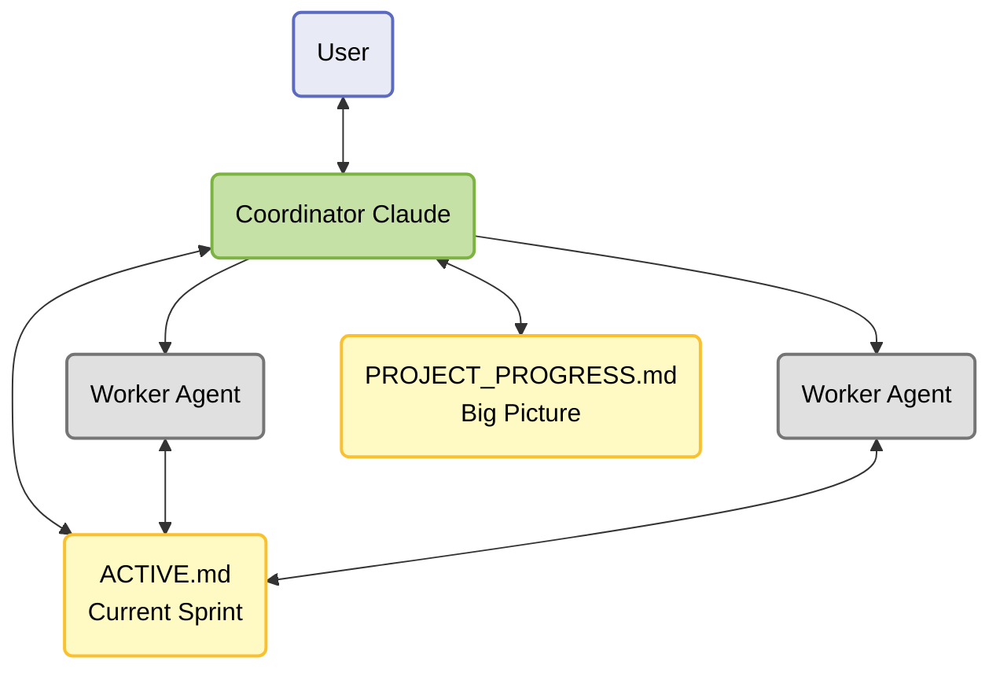
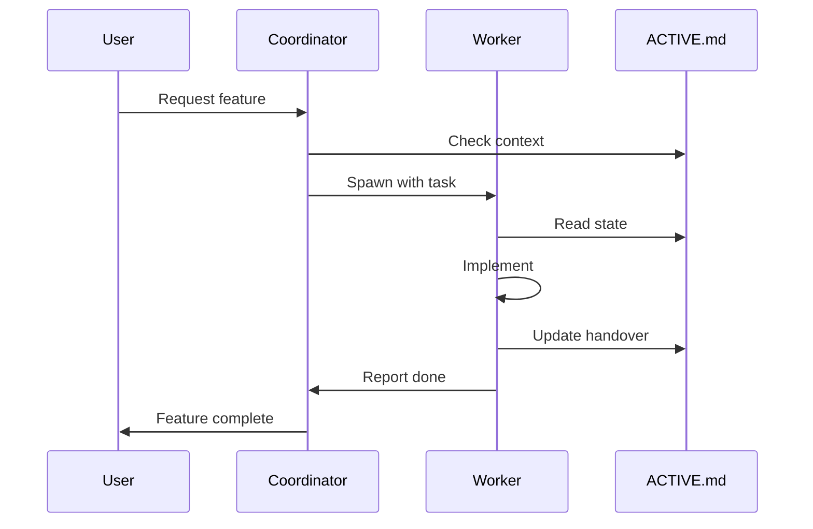
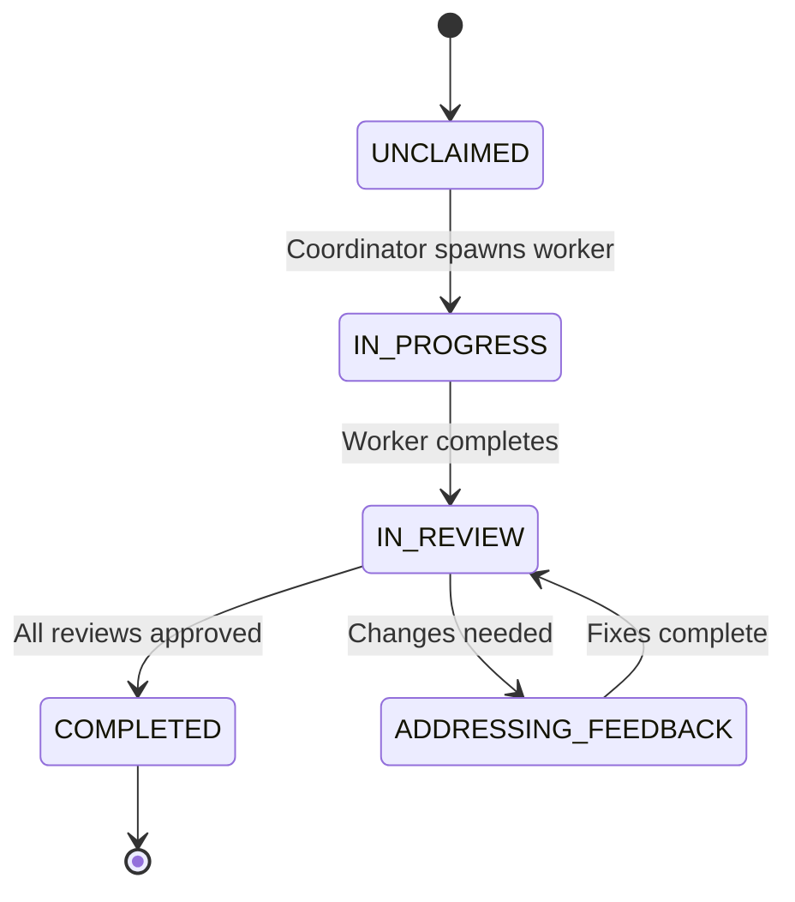
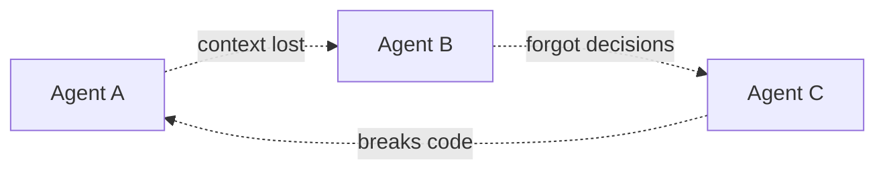
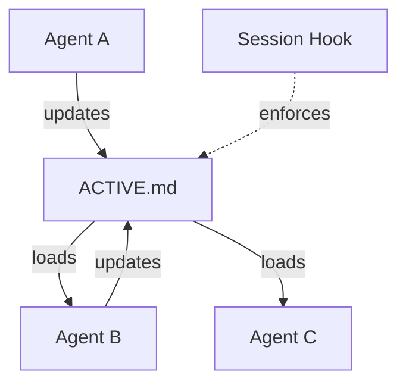

# Claude Kanban

[](https://opensource.org/licenses/MIT)
[](https://github.com/alessiocol/claude-kanban/commits)
[](https://github.com/alessiocol/claude-kanban/issues)

A Kanban-inspired workflow system for coordinating multiple Claude agents over long-term, multi-phase projects. Uses state transitions, visual workflows, and enforced WIP limits to prevent context loss between agent sessions.

## What is This?

This template addresses the context amnesia problem - where AI agents lose context between sessions, forget past decisions, and break each other's work. It applies Kanban principles to AI agent coordination: visualize work, limit WIP, manage flow, and make process explicit.

**Key Features:**
- **Kanban Board States:** Tasks flow through defined states (`UNCLAIMED` → `IN_PROGRESS` → `IN_REVIEW` → `COMPLETED`)
- **WIP Limits:** Only one task in progress per agent to maintain focus
- **Visual Workflow:** Clear state tracking in `ACTIVE.md` (your kanban board)
- **Pull System:** Agents pull tasks from the backlog when ready, not pushed randomly
- **Continuous Flow:** Documented handovers enable seamless agent-to-agent transitions
- **Process Enforcement:** Git hooks ensure discipline without manual overhead

## Architecture



**Two-Role Pattern:**
- **Coordinator** - Talks to user, reviews/updates `ACTIVE.md`, maintains `PROJECT_PROGRESS.md`, spawns agents
- **Workers** - Implement tasks, update `ACTIVE.md`, report completion to Coordinator

**Core Files:**
- `ACTIVE.md` - Current sprint state (~200 lines, loaded every session)
- `PROJECT_PROGRESS.md` - Big picture tracking (phases, metrics, progress)
- `CLAUDE.md` - Complete workflow guide

## Quick Start

### 1. Install Hooks

```bash
# Install pre-commit framework
pip install pre-commit

# Install hooks
./.claude/workflow/hooks --install
```

### 2. Customize for Your Project

**Create your project files:**

1. `VISION.md` - Your architecture and design principles
2. `ROADMAP.md` - Your phase-by-phase implementation plan
3. `PROJECT_PROGRESS.md` - Track progress (Coordinator maintains)
4. `ACTIVE.md` - Update with first task and project rules

**Customize commit validation:**

Edit `.claude/hooks/git/commit-msg` to add/remove tags.

**Add custom hooks:**

Edit `.pre-commit-config.yaml` to add linting, formatting, etc.

### 3. Start Your First Sprint

1. Update `ACTIVE.md` with your first task
2. Coordinator reads `.claude/agents/worker.md` → customizes → spawns worker
3. Worker implements, updates `ACTIVE.md`, commits
4. Spawn review agents if needed
5. Continue!

## How It Works



**Session Flow:**
1. **Start** - Hook displays `ACTIVE.md` automatically
2. **Work** - Follow PROJECT RULES, commit frequently, document decisions
3. **End** - Update `ACTIVE.md` handover, commit, push

## Kanban Board States



Tasks flow through your Kanban board (`ACTIVE.md`) with clear state transitions. The Coordinator moves tasks between states using the `.claude/workflow/transition` command, enforcing proper workflow progression.

**Board Columns:**
- **`UNCLAIMED`** - Backlog of tasks ready to start
- **`IN_PROGRESS`** - Active work (WIP limit: 1 per agent)
- **`IN_REVIEW`** - Awaiting review from multiple agents in parallel
- **`ADDRESSING_FEEDBACK`** - Fixes being implemented
- **`COMPLETED`** - Done, moved to "RECENTLY COMPLETED" section

**Available Reviewers:**
- **Staff Engineer** - Architecture, design patterns
- **TDD Expert** - Test quality, coverage
- **QA Engineer** - End-to-end functionality, edge cases
- **Security Reviewer** - Vulnerabilities, data protection
- **Performance Reviewer** - Efficiency, scalability

## Why Kanban for AI Agents?

Traditional Kanban manages human work. Claude Kanban adapts these principles for AI agents:

| Kanban Principle | Claude Kanban Implementation |
|------------------|------------------------------|
| **Visualize Work** | `ACTIVE.md` acts as your board with clear sections |
| **Limit WIP** | One task per agent, enforced by state machine |
| **Manage Flow** | State transitions track progress (`UNCLAIMED` → `COMPLETED`) |
| **Make Process Explicit** | `CLAUDE.md` documents workflow, hooks enforce it |
| **Continuous Improvement** | Archive completed work, compress to maintain focus |

**Traditional Multi-Agent Problem:**


**This Template's Solution:**


- ✅ Hook forces context load (`ACTIVE.md`) every session
- ✅ Handover checklist enforces documentation
- ✅ State machine validates transitions
- ✅ Context stays constant (~200 lines) via progressive compression

## Project Structure

```
.
├── README.md                    # This file
├── CLAUDE.md                    # Main workflow guide
├── ACTIVE.md                    # Current sprint state (your Kanban board)
├── PROJECT_PROGRESS.md          # Big picture tracking (stub template)
├── VISION.md                    # Architecture & design principles (stub template)
├── LICENSE                      # MIT License
├── .pre-commit-config.yaml      # Hook configuration
├── .claude/
│   ├── agents/                  # Agent personas (6 reviewers + worker)
│   ├── hooks/                   # Git and session hooks
│   ├── workflow/                # State transition & hook management
│   └── settings.json            # Claude Code hook config
└── .git/
    └── hooks/                   # Managed by pre-commit
```

## Documentation

- **[CLAUDE.md](CLAUDE.md)** - Complete workflow guide
- **[.claude/agents/](.claude/agents/)** - Agent persona definitions

## Use Cases

This template is suitable for:
- Long-term software projects (3-12+ months)
- Multi-phase implementations
- Projects requiring code reviews
- Teams wanting deterministic agent coordination
- Projects where context preservation is critical

## License

MIT License - see [LICENSE](LICENSE) file

